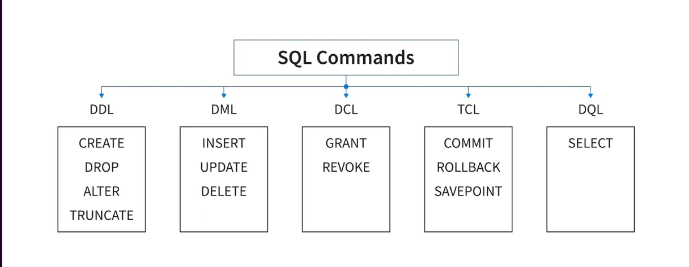

# PostgreSQL Quick Guide

PostgreSQL is the world’s most advanced open-source relational database management system (RDBMS).

---

## 🚀 Installation

- Install PostgreSQL and set the password.
- If `psql` command doesn’t work in PowerShell or other terminals:
  1. Press **Win → Search "Environment Variables"**.
  2. Go to **System Variables → Path → Edit → New**.
  3. Navigate to `C:\Program Files\PostgreSQL\<version>\bin`.
  4. Copy the path and paste it into **Path**.
  5. Save and restart the terminal.

---

## 🖥️ Starting `psql`

```bash
psql -U postgres
```

- Default username: postgres
- Enter your password → (1234) press Enter

📋 Common Commands

| Command             | Description                 |
| ------------------- | --------------------------- |
| `SELECT version();` | Check SQL version           |
| `\l`                | List all databases          |
| `\c databaseName`   | Connect to a database       |
| `\d`                | Show relations/tables       |
| `\dn`               | List schemas                |
| `\! cls`            | Clear console               |
| `\dt`               | Show only tables            |
| `\d+`               | Show tables with extra info |
| `\du`               | List database users         |
| `\conninfo`         | Show connection info        |
| `\q`                | Quit `psql`                 |

📂 Database Management

- Create Database:

```sql
CREATE DATABASE databaseName;
```

- Connect to Database:

```sql
\c databaseName
```

✅ Example Workflow

```bash

# Open PostgreSQL
psql -U postgres

# Check version
SELECT version();

# Create new database
CREATE DATABASE testdb;

# Connect to database
\c testdb;

# List all tables
\dt
```

# 🔐 User, Role & Privilege Management in PostgreSQL

This guide covers creating users, roles, and managing privileges in PostgreSQL.

---

## 👤 User & Role Creation

- **Create a new user:**

```sql
CREATE USER user1 WITH LOGIN ENCRYPTED PASSWORD '1234';
```

- Create a new role:

```sql
CREATE ROLE role1 WITH LOGIN ENCRYPTED PASSWORD '1234';
```

### 📂 Table Management

- Create a table:

```sql
CREATE TABLE test_table (
  name VARCHAR(50)
);
```

- Insert data:

```sql
INSERT INTO test_table(name) VALUES ('mezba');
```

- View data (as postgres user):

```sql
SELECT * FROM test_table;
```

## 🚫 Access Denied Example

Open another shell and connect as user1:

```bash
psql -U user1 -d postgres
```

Try viewing the table:

```bash
SELECT * FROM test_table;
```

👉 You’ll see Access Denied, since user1 does not have privileges.

## ✅ Granting & Revoking Privileges

- Grant full privileges on a specific table:

```sql
GRANT ALL PRIVILEGES ON TABLE test_table TO user1;
```

- Grant only SELECT permission:

```sql
GRANT SELECT ON TABLE test_table TO user2;

```

- Revoke permission:

```sql
REVOKE SELECT ON TABLE test_table FROM user1;

```

## 📌 Schema-Level Privileges

- Grant all privileges on all existing tables inside public schema:

```sql
GRANT ALL PRIVILEGES ON ALL TABLES IN SCHEMA public TO user2;

```

## ⚠️ Note: New tables created after this command won’t be automatically accessible.

- Grant privileges on future tables too:

```sql
GRANT ALL PRIVILEGES ON TABLE test_table TO user1;
```

- Grant SELECT access on all existing tables in schema to a role:

```sql
GRANT SELECT ON ALL TABLES IN SCHEMA public TO role1;
```

## 👥 Grant Role to a User

- Give user3 the permissions and access rights of role1:

```sql
GRANT role1 TO user3;
```

- This means:
  - user3 becomes a member of role1.
  - user3 inherits all privileges granted to role1.

## 📋 Check Permissions

```sql
\z test_table
```

## 🚀 Verify Access

Open another shell as user3:

```sql
psql -U user3 -d postgres
```

Then run:

```sql
SELECT * FROM test_table;

```

👉 You should now see the table data because user3 inherited privileges from role1.

---

## 🗄️ Structured Query Language (SQL)

SQL is divided into different categories based on functionality.

- DDL (Data Definition Language)

  - Used to define database structure (CREATE, ALTER, DROP, TRUNCATE)

- DML (Data Manipulation/Modification Language)

  - Used to modify data (INSERT, UPDATE, DELETE)

- DCL (Data Control Language)

  - Used to control access (GRANT, REVOKE)

- TCL (Transaction Control Language)

  - Used to manage transactions (COMMIT, ROLLBACK, SAVEPOINT)

- DQL (Data Query Language)
  - Used to query data (SELECT)



```sql
SELECT * FROM test_table;

```

```sql
SELECT * FROM test_table;

```

```sql
SELECT * FROM test_table;

```

```sql
SELECT * FROM test_table;

```

```sql
SELECT * FROM test_table;

```

## 🖥️ Valentina Studio & PostgreSQL Database Management

Valentina Studio is a graphical database management tool used to work with different databases like PostgreSQL, MySQL, SQLite, MariaDB, and more.
It allows you to create, update, and delete databases easily with a GUI, but you can also use SQL commands directly.

## 🗂️ PostgreSQL Data Types

PostgreSQL supports a wide variety of data types for handling different kinds of values such as numbers, text, dates, JSON, arrays, etc.

## ✅ Core Data Types

1. Boolean

   - Values: TRUE, FALSE, NULL

2. Numbers

   - SMALLINT, INT, BIGINT, FLOAT4, FLOAT8, NUMERIC

3. Binary

   - Stores binary strings of data.

4. Date/Time

   - DATE, TIME, TIMESTAMP, TIMESTAMPTZ, INTERVAL

5. JSON

   - JSON, JSONB for structured JSON storage.

6. Character

   - CHAR, VARCHAR, TEXT

7. UUID

   - Universally Unique Identifier.

8. Array

   - Supports arrays of any built-in or user-defined type.

9. XML

- Store XML data.

### INT

- Range: -2,147,483,648 to 2,147,483,647
- Storage: 4 bytes
- Usage: Commonly used for integer values within standard range

### BIGINT

- Range: -9,223,372,036,854,775,808 to 9,223,372,036,854,775,807
- Storage: 8 bytes
- Usage: Suitable for storing very large integer values

### SMALLINT

- Range: -32,768 to 32,767
- Storage: 2 bytes
- Usage: Suitable for storing small integer values

### FLOAT4 (Single Precision)

- Storage: 4 bytes
- Precision: 6-digit precision

### FLOAT8 (Double Precision)

- Storage: 8 bytes
- Precision: 15-digit precision

### NUMERIC(precision, scale)

- Range: Unlimited precision
- Storage: Variable (depends on precision & scale)
- Example: NUMERIC(4,3)

### SERIAL

- Range: Like integers
- Usage: Auto-incrementing integer

### CHAR

- Type: Fixed-length character type
- Storage: Fixed length (pads with spaces if shorter)
- Example: CHAR(10) → Always 10 characters

### VARCHAR

- Type: Variable-length character type
- Storage: Varies up to max length
- Example: VARCHAR(255) → Up to 255 characters

### TEXT

- Type: Variable-length, unlimited size
- Usage: For large text strings
- Example: TEXT column → Stores articles, descriptions, etc.

# 🏗️ Creating Tables in PostgreSQL

You can create a table with **multiple columns** and apply different data types and constraints.

---

## 📌 Syntax

```sql
CREATE TABLE table_name
(
  column1 datatype constraint,
  column2 datatype constraint,
  column3 datatype constraint,
  ...
);

```

### ✅ Example

```sql
CREATE TABLE employees
(
 id SERIAL PRIMARY KEY,
 name VARCHAR(100) NOT NULL,
 age INT CHECK (age > 18),
 salary NUMERIC(10,2),
 is_active BOOLEAN DEFAULT true,
 created_at TIMESTAMP DEFAULT CURRENT_TIMESTAMP
);
```

# Column Constraints in PostgreSQL

PostgreSQL allows you to enforce **rules on table columns** using constraints.

---

## Not Null

```sql
CREATE TABLE example(
  id SERIAL PRIMARY KEY,
  name VARCHAR(50) NOT NULL
);
```

## Unique

```sql
CREATE TABLE example(
 id SERIAL PRIMARY KEY,
 email VARCHAR(255) UNIQUE
);
```

## Foreign Key

```sql
CREATE TABLE orders(
  order_id SERIAL PRIMARY KEY,
  customer_id INTEGER REFERENCES customers(customer_id)
);
```

## Default

```sql
CREATE TABLE example(
  id SERIAL PRIMARY KEY,
  status BOOLEAN DEFAULT true
);
```

## Check

```sql
CREATE TABLE example(
  id SERIAL PRIMARY KEY,
  age INTEGER CHECK (age >= 18)
);
```

## Complete Example

```sql
CREATE TABLE person(
  person_id SERIAL PRIMARY KEY,
  first_name VARCHAR(50) NOT NULL,
  last_name VARCHAR(50) NOT NULL,
  is_active BOOLEAN DEFAULT TRUE,
  age INTEGER CHECK (age >= 0),
  email VARCHAR(255) UNIQUE
);
```

# Inserting Data into a Table and Checking Constraints

---

## Single-Row Insert

```sql
INSERT INTO your_table (column1, column2, column3)
VALUES (value1, value2, value3);
```

### Example

```sql
INSERT INTO employees (first_name, last_name, hire_date)
VALUES ('Jhon', 'Doe', '2022-01-15');
```

### Multi-Row Insert

```sql
INSERT INTO your_table (column1, column2, column3)
VALUES
  (value1_1, value2_1, value3_1),
  (value1_2, value2_2, value3_2),
  ...;
```

### Example

```sql
INSERT INTO employees (first_name, last_name, hire_date)
VALUES
  ('Jan', 'Smith', '2022-02-25'),
  ('Bob', 'Jhonson', '2021-08-21');
```

# ALTER and SELECT in PostgreSQL

---

## ALTER TABLE

The `ALTER TABLE` statement is used to **modify an existing table**.  
Actions include: rename a table, add/drop column, modify data type of a column, set default value, rename a column, add/drop constraint.

```sql
ALTER TABLE table_name
  action;
```

```sql
-- Rename a table
ALTER TABLE old_table_name RENAME TO new_table_name;

-- Add a column
ALTER TABLE employees ADD COLUMN department VARCHAR(50);

-- Drop a column
ALTER TABLE employees DROP COLUMN department;

-- Modify column data type
ALTER TABLE employees ALTER COLUMN salary TYPE NUMERIC(12,2);

-- Set default value for a column
ALTER TABLE employees ALTER COLUMN is_active SET DEFAULT true;

-- Rename a column
ALTER TABLE employees RENAME COLUMN first_name TO fname;

-- Add a constraint
ALTER TABLE employees ADD CONSTRAINT check_age CHECK (age >= 18);

```

## SELECT Statement

The SELECT statement is used to retrieve data from one or more tables.
It can be customized with conditions, sorting, grouping, and joining.

Syntax Elements

```sql
SELECT column1, column2, ...
FROM table_name
WHERE condition
GROUP BY column
HAVING condition
ORDER BY column
LIMIT number
OFFSET number;
```

## Key Clauses

- SELECT → Retrieves data from one or more columns
- FROM → Specifies the table(s)
- WHERE → Filters rows based on conditions
- ORDER BY → Sorts results
- GROUP BY → Groups rows with the same values
- HAVING → Filters groups from GROUP BY
- JOIN → Combines rows from multiple tables
- DISTINCT → Returns unique values
- LIMIT → Maximum number of rows
- OFFSET → Number of rows to skip

# Functions in PostgreSQL

PostgreSQL supports **Scalar** and **Aggregate** functions for data manipulation and analysis.

---

## 1. Scalar Functions

Scalar functions operate on a **single value** and return a **single value** for each row.

### Common Scalar Functions

```sql
-- Convert string to uppercase
UPPER('hello');  -- Result: 'HELLO'

-- Convert string to lowercase
LOWER('HELLO');  -- Result: 'hello'

-- Concatenate strings
CONCAT('Hello', ' ', 'World');  -- Result: 'Hello World'

-- Get length of a string
LENGTH('PostgreSQL');  -- Result: 10
```

### 2. Aggregate Functions

Aggregate functions operate on a set of values and return a single summarizing value.
Often used with GROUP BY.

Common Aggregate Functions

```sql
-- Average of a column
AVG(salary)

-- Maximum value
MAX(salary)

-- Minimum value
MIN(salary)

-- Sum of values
SUM(salary)

-- Count rows
COUNT(*)

```
